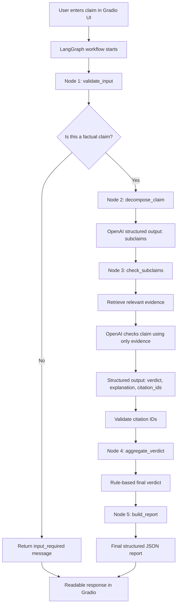

# Session 19: Mermaid Architecture

## What We Are Building

In this session, we document the system workflow using Mermaid.

Mermaid lets us write diagrams as text. This is useful for project reports, README files, and class presentations.

## Current System Diagram



## What Each Part Does

### Gradio UI

Gradio gives the user a browser interface.

The user enters a claim and clicks **Fact Check**.

### LangGraph

LangGraph organizes the workflow into named nodes:

```text
validate_input
decompose_claim
check_subclaims
aggregate_verdict
build_report
build_guardrail_report
```

The first node is a guardrail. If the user enters a question instead of a factual claim, the workflow stops early and asks the user to rewrite it as a claim.

### OpenAI Platform

OpenAI is used for language-heavy tasks:

1. Breaking a complex claim into subclaims
2. Checking each subclaim against retrieved evidence
3. Returning structured JSON

### Retrieval

Retrieval finds relevant evidence for each subclaim.

Right now we use a local evidence store and Wikipedia fallback, but this part can change later as we add better sources.

### Validation

Validation checks whether citation IDs returned by the model exist in the retrieved evidence.

### Aggregation

Aggregation combines subclaim verdicts into one final verdict.

This is rule-based, not an extra model call.

### Final Report

The final report contains:

1. Original claim
2. Final verdict
3. Final reason
4. Subclaims
5. Evidence
6. Citations
7. Explanations
8. Validation status
9. Retrieval source
10. Retrieval diagnostics

## Key Takeaway

The system is no longer just one prompt.

It is a small agentic workflow:

```text
UI -> guardrail -> graph -> retrieval -> model calls -> validation -> final report
```

If the input is not a claim, the guardrail returns an `input_required` message before retrieval or model fact-checking happens.
